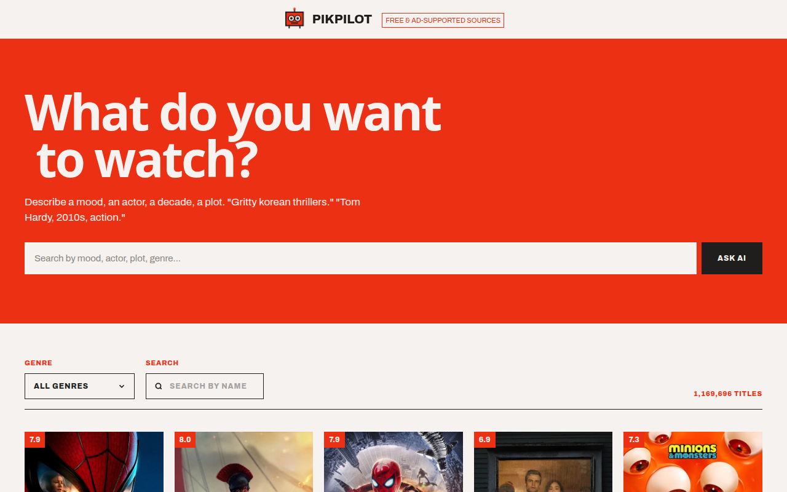
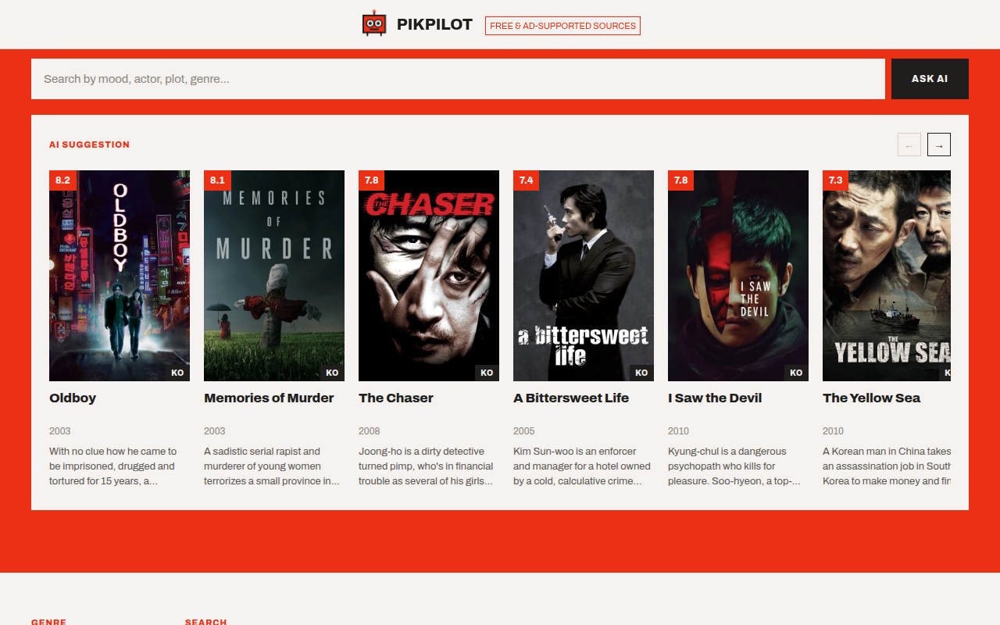
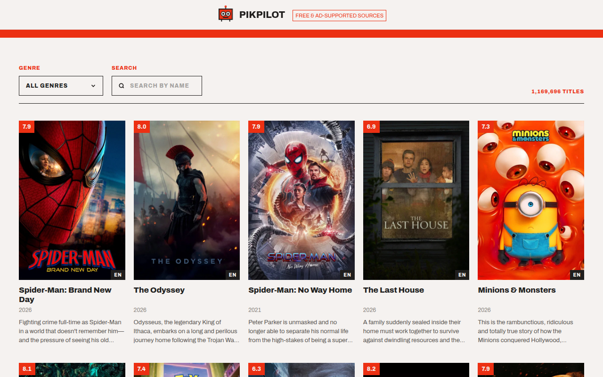
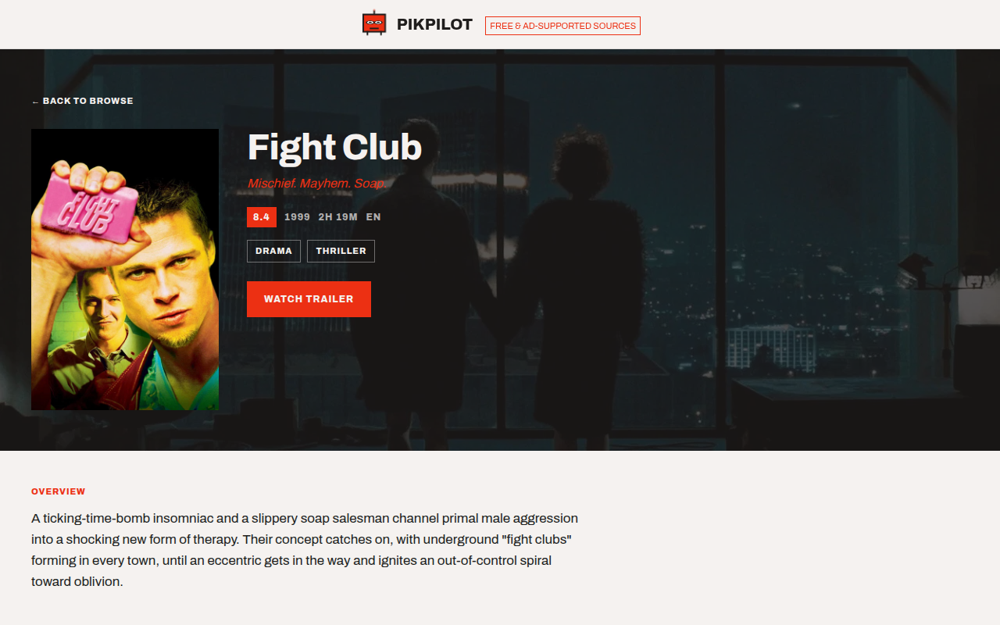
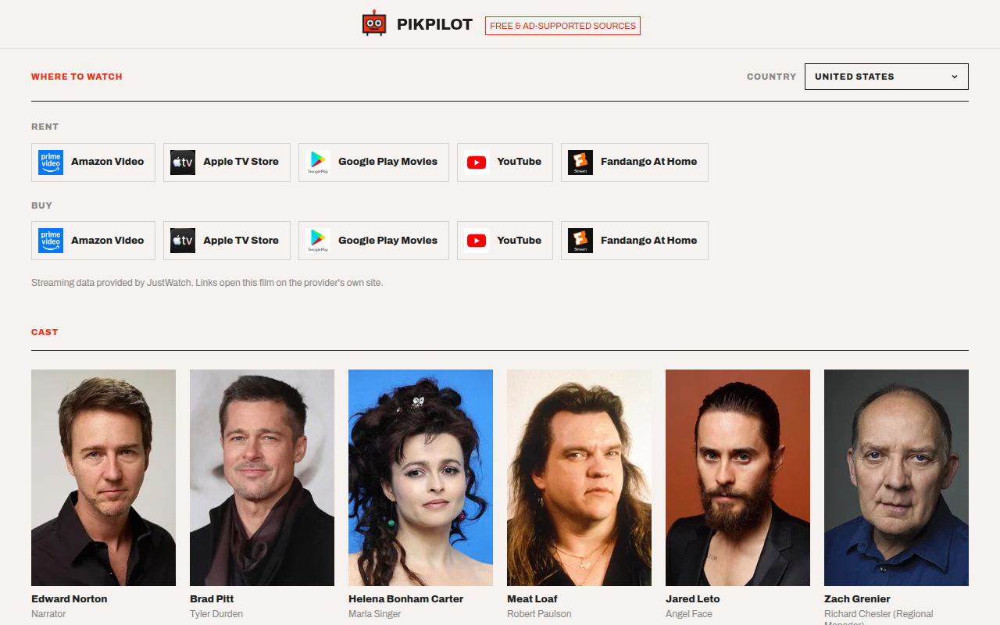
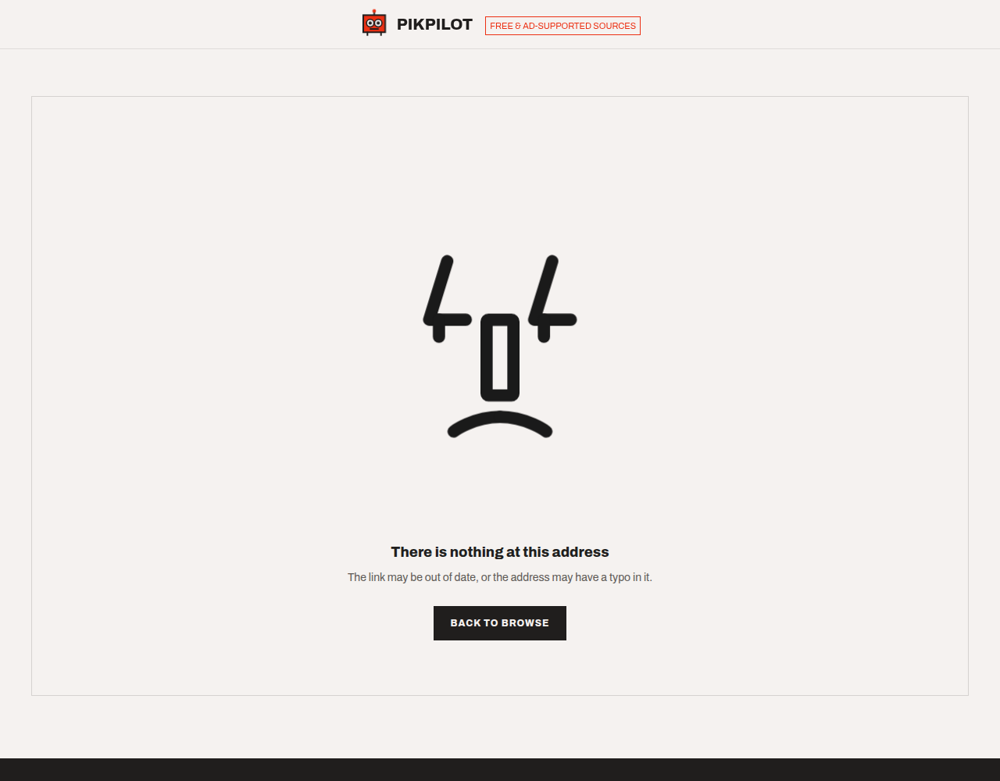

# PikPilot

**Describe what you're in the mood for. Get films you can actually watch tonight.**

Deciding what to watch is not a shortage-of-films problem — it's twenty minutes lost scrolling a grid before giving up. PikPilot takes a sentence in plain language ("gritty korean thrillers", "Tom Hardy, 2010s, action") and answers with real films, each one linked to a page that tells you which services carry it in your country.



---

## Contents

- [What it does](#what-it-does)
- [Screenshots](#screenshots)
- [How it works](#how-it-works)
- [Tech stack](#tech-stack)
- [Project layout](#project-layout)
- [Running it locally](#running-it-locally)
- [Environment variables](#environment-variables)
- [API reference](#api-reference)
- [Deployment](#deployment)
- [Notable implementation details](#notable-implementation-details)
- [Attribution](#attribution)

---

## What it does

**Ask in plain language.** A sentence goes to a language model, which answers with film titles. Those titles are then resolved against TMDB, so every card on screen is a real catalogue record — poster, rating, release date, and the id needed to open its detail page.

**Browse the catalogue.** Filter by genre, search by title, page through results. Search is debounced so typing doesn't fire a request per keystroke, and the two filters reset paging when they change.

**Find out where to watch.** Every detail page lists the services carrying that film, grouped as free → ad-supported → streaming → rent → buy, for the country the visitor is actually in. Each provider links out to that film on the provider's own site.

**Share a link.** Every film has its own URL that survives a reload, a paste into chat, and a cold visit from a search result.

---

## Screenshots

### AI suggestions

A sentence in, a scrolling row of real films out. Each card opens the same detail page as a card from the catalogue grid, because it *is* the same component fed the same kind of record.



### Browse

Genre, title search and a live result count, over a paginated grid.



### Movie details

Backdrop, poster, tagline, rating, runtime, genres and a trailer link, followed by the overview, cast and production facts.



### Where to watch

Availability differs by country — the same film streams in one and is rent-only in the next — so the country is detected from the browser and can be changed by hand. The list below is the United States; switching to another country re-groups it entirely.



### Not found



---

## How it works

The interesting part is what happens between "gritty korean thrillers" and a row of posters.

```
Browser ──POST /suggestion──▶ Express API ──▶ OpenRouter (LLM)
                                   │              │
                                   │         ["Oldboy" 2003, "The Chaser" 2008, …]
                                   │              │
                                   ▼              ▼
                             TMDB /search/movie, one call per title
                                   │
                                   ▼
                    Real records: id, poster, rating, overview
                                   │
Browser ◀──────── { movies: [...] } ┘
```

A language model is good at taste and bad at facts. It knows that *Memories of Murder* fits "gritty korean thriller"; it does not reliably know that film's id, poster path, or rating, and it certainly doesn't know what's streaming today. So the model is used only to *name* films, and every fact rendered on screen comes from TMDB.

Three consequences of that split are worth knowing:

1. **The model is asked for JSON, not prose** — a `{title, year}` array. It wraps that in a markdown fence more often than not, so the fence is stripped before parsing, and a bracket-slice is used rather than trusting the model to obey the format exactly.
2. **Titles that don't resolve are dropped.** A hallucinated film simply doesn't appear, rather than rendering as a broken card.
3. **Duplicates are removed by id.** Models repeat themselves, and two different titles can resolve to the same record.

The API keeps the TMDB and OpenRouter credentials server-side; the browser never sees either.

---

## Tech stack

| Layer | Choice |
| --- | --- |
| UI | React 19, React Router 7 |
| Build | Vite 8 |
| Styling | Tailwind CSS 4, daisyUI |
| Animation | GSAP (mascot eye tracking, hero fold-in), styled-components (404 face) |
| API | Express 5, `express-rate-limit`, `cors` |
| Data | [TMDB](https://www.themoviedb.org/) for the catalogue, providers, cast and images |
| AI | [OpenRouter](https://openrouter.ai/) |
| Hosting | Netlify (frontend), Render (API) |

---

## Project layout

```
pikpilot/
├── index.html              # Vite entry — lives at the repo root
├── vite.config.js          # publicDir points at front/public
├── netlify.toml            # SPA fallback so deep links survive a reload
├── front/
│   ├── src/
│   │   ├── App.jsx         # Routes + the global footer
│   │   ├── api.js          # Reads VITE_API_URL, fails loudly if unset
│   │   ├── watchLinks.js   # TMDB provider id → that provider's own site
│   │   └── useSlowRequest.js
│   ├── pages/
│   │   ├── Home.jsx
│   │   ├── Moviedetails.jsx
│   │   └── Notfound.jsx
│   ├── components/         # Navbar, Hero, Filters, Movies, Moviecomponent, …
│   └── public/             # favicon and static assets
└── back/
    ├── server.js           # Express app, CORS, rate limits, routes
    └── services/
        ├── theMovieDb.js   # TMDB proxy: list, search, details, providers
        └── aiService.js    # Prompt, JSON parsing, title resolution
```

---

## Running it locally

**Requires Node 20 or newer.** Vite 8 uses `styleText` from `node:util`, which Node 18 does not export — the build fails with a confusing `SyntaxError` if you're on an older runtime.

```bash
git clone https://github.com/hamdiheb/PIKPILOT.git
cd PIKPILOT
npm install
```

Create `back/.env` from the template and fill in your keys:

```bash
cp back/.env.example back/.env
```

Then run the two halves in separate terminals:

```bash
npm start     # API on http://localhost:3000
npm run dev   # UI  on http://localhost:5173
```

Other scripts:

```bash
npm run build     # production build into dist/
npm run preview   # serve that build locally
npm run lint      # oxlint
```

---

## Environment variables

### `back/.env` — server-side, never committed

| Variable | Purpose |
| --- | --- |
| `TMDB_TOKEN` | TMDB API read access token (sent as a Bearer token) |
| `TMDB_URL_BASE` | `https://api.themoviedb.org/3` |
| `OPEN_ROUTER_API_KEY` | OpenRouter key for the suggestion endpoint |
| `FRONTEND_URL` | Origin allowed through CORS. Comma-separate for several |
| `PORT` | Defaults to 3000 |

The server **refuses to start** without `FRONTEND_URL`, rather than falling back to a wide-open CORS policy that would let any site on the internet spend your OpenRouter credits.

### Root `.env.development` / `.env.production` — client-side, safe to commit

| Variable | Purpose |
| --- | --- |
| `VITE_API_URL` | Base URL of the API |

Vite inlines this at build time, so it is public by definition — never put a secret behind a `VITE_` prefix. `front/src/api.js` throws at startup if it's missing, so a misconfigured deploy fails immediately instead of quietly requesting `undefined/movies`.

---

## API reference

Base URL is whatever `VITE_API_URL` points at. All responses are wrapped in a `message` key.

| Method | Route | Purpose |
| --- | --- | --- |
| `GET` | `/health` | Liveness check. Answers without touching TMDB |
| `GET` | `/list` | Genre list for the filter dropdown |
| `GET` | `/movies` | Paginated catalogue. Query: `page`, `genre`, `search` |
| `GET` | `/movies/:id` | One film with `credits`, `videos` and `watch/providers` appended |
| `POST` | `/suggestion` | Body `{ query }`. Returns `{ movies, text }` |

Rate limits are per IP, per 15 minutes: **300** for the TMDB proxy routes, **20** for `/suggestion`, which costs money per call.

`GET /movies` switches endpoints based on the query, because TMDB splits the job in two: `/search/movie` matches a title but ignores genre, while `/discover/movie` filters by genre but takes no title. When both are supplied, the genre filter is applied to the search results in-process.

---

## Deployment

**Frontend → Netlify.** Build `npm run build`, publish `dist`. `netlify.toml` rewrites every path to `index.html` with a `200`, which is what makes `/movie/550` work on a cold load — without it, Netlify looks for a file at that path and serves its own 404 before any JavaScript runs.

**API → Render.** Start command `npm start`. Set `FRONTEND_URL` to the deployed Netlify origin or the browser will be blocked by CORS.

> **A note on the free tier.** Render's free instances sleep after ~15 minutes of inactivity, and the first request afterwards waits around 30 seconds for the process to boot — measured at 33s, against 0.24s once warm. The UI explains that wait rather than showing an unexplained skeleton, and pointing any uptime pinger at `/health` every 10 minutes keeps the instance from sleeping in the first place.

---

## Notable implementation details

**Out-of-order responses can't win.** Every fetch that can be superseded — page changes, filter changes, navigating between two films — sets a flag its cleanup clears, and a stale response is discarded rather than allowed to overwrite newer results.

**Filters reset paging during render.** Changing genre or search resets to page 1 in the render pass rather than an effect, so the request fires once for the new filters instead of once for the old page and again for page 1.

**Provider links go to the provider.** TMDB names each service but gives only one link per country, pointing back at TMDB. `front/src/watchLinks.js` maps provider ids to that service's own site — with suffix rules covering the hundreds of "… Amazon Channel" and "… Apple TV Channel" add-ons — and falls back to the TMDB page for anything unmapped.

**Slow requests explain themselves.** `useSlowRequest` returns true only once a request has been running long enough to need explaining (8s for the catalogue, 10s for the model). A warm server answers in a quarter of a second, so the message never appears in normal use.

**Input is validated before it costs anything.** `/suggestion` rejects a missing or over-long query before it reaches OpenRouter; `:id` and `genre` are checked against digit patterns before being interpolated into a TMDB URL.

**`trust proxy` is set to 1.** Render terminates TLS at its own proxy, so without this every request appears to come from one address and the rate limits become a single shared budget for the whole internet.

---

## Attribution

This product uses the TMDB API but is not endorsed or certified by TMDB. Streaming availability data is provided by JustWatch.

---

Developed by **Iheb Hamdi**.
